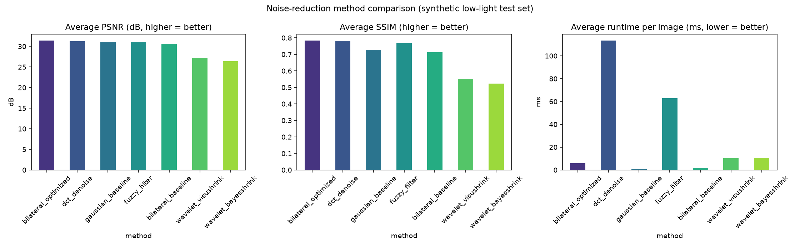
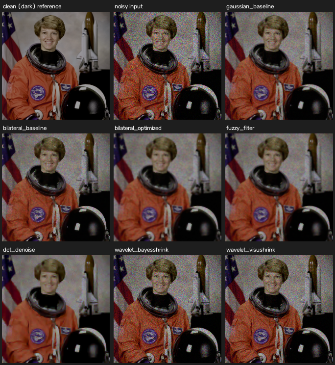

# Optimized Noise Reduction Filter for Low-Light Video (OpenCV)

Image-processing based noise reduction filter implementation, developed
for the Work-let brief *"Image processing based optimized noise
reduction filter implementation"* (Work-let area: Image processing,
C++ & OpenCV; mentors Ashish Kumar Singh & Harisha HS).

**Problem statement.** Noise is introduced into an image at capture or
transmission time, from several sources; this is especially severe in
low-light video recording, where high sensor gain amplifies both
signal-dependent shot noise and sensor read noise. The brief asks for a
literature survey of optimized noise-reduction filters (bilateral,
fuzzy, DCT-based, wavelet-based), selection of the best-performing
method for continuous low-light video, and a measured, optimized
implementation with a path to Android deployment.

**What this repository contains**: all four filter families
implemented and benchmarked in Python/OpenCV, a synthetic
low-light+noise data pipeline for reproducible quantitative evaluation
(PSNR/SSIM), a continuous-video pipeline with motion-adaptive temporal
filtering and FPS measurement, a full literature survey, a benchmark
report with the actual measured numbers, and an Android porting plan.

## Result summary

| Method | Avg PSNR (dB) | Avg SSIM | Avg runtime/image | Real-time video? |
|---|---:|---:|---:|---|
| **Bilateral filter, optimized (this project)** | **31.44** | **0.783** | 12.3 ms | **Yes -- 66-71 fps @ 480x320** |
| DCT block-thresholding | 31.21 | 0.781 | 1310 ms | No (0.6 fps) |
| Bilateral filter, fixed parameters | 30.60 | 0.713 | 11.4 ms | Yes -- 70-71 fps |
| Fuzzy weighted-mean filter | 30.97 | 0.767 | 203 ms | No (3.9 fps) |
| Wavelet shrinkage (VisuShrink) | 27.21 | 0.549 | 21.8 ms | Yes -- ~35-38 fps |
| Wavelet shrinkage (BayesShrink) | 26.37 | 0.523 | 22.8 ms | Yes -- ~35-38 fps |
| *Noisy input (no denoising)* | *21.63* | *0.316* | *0* | -- |

**Selected method: the optimized bilateral filter** -- best average
quality *and* one of the two fastest methods, comfortably real-time
even in pure Python. Full methodology, per-case numbers, and the
video/temporal-filtering results are in
[`docs/BENCHMARK_REPORT.md`](docs/BENCHMARK_REPORT.md); the literature
survey behind the method choice is in
[`docs/LITERATURE_SURVEY.md`](docs/LITERATURE_SURVEY.md); the Android
deployment plan is in [`docs/ANDROID_PORTING.md`](docs/ANDROID_PORTING.md).





## What "optimized" means here

`noise_reduction/bilateral.py`'s `bilateral_optimized()` is not just a
call to `cv2.bilateralFilter` -- it adds three concrete optimizations
over the plain/baseline bilateral filter, each backed by the
literature survey and validated in the benchmark report:

1. **Noise-adaptive parameters** -- `sigma_color` is estimated per
   frame from a robust wavelet-MAD noise estimator instead of a fixed
   constant, so the filter's smoothing strength tracks the scene's
   actual (low-light-dependent) noise level.
2. **Luma/chroma split** -- filtering happens in YCrCb with the luma
   channel filtered at full strength and chroma at a cheaper setting,
   mirroring standard video-codec chroma-subsampling practice.
3. **Multi-resolution filtering** -- an optional `downscale` parameter
   filters the luma channel at reduced resolution and upsamples back
   (the classic "fast bilateral filter" trick), an explicit
   speed/quality knob for tighter performance budgets.

It is also paired with a **motion-adaptive temporal filter**
(`noise_reduction/video_pipeline.py`) for continuous video streams,
addressing the brief's requirement to check the method against a
video stream, not just single frames.

## Repository layout

```
noise_reduction/         Core library (the four filter families + shared helpers)
  bilateral.py              Baseline + optimized bilateral filter
  fuzzy_filter.py            Fuzzy weighted-mean filter
  dct_denoise.py              Block-DCT hard-thresholding denoising
  wavelet_denoise.py           Wavelet shrinkage denoising (BayesShrink/VisuShrink)
  low_light.py               Low-light + sensor-noise simulation, noise-level estimation
  video_pipeline.py          Continuous-video pipeline + motion-adaptive temporal filter
  metrics.py                 PSNR / SSIM / runtime measurement

scripts/
  generate_test_data.py      Builds the synthetic low-light test images + video
  benchmark.py                Runs the full quality/performance comparison
  denoise_image.py             CLI: denoise a single image
  denoise_video.py             CLI: denoise a video file

tests/                     pytest unit tests for every module
data/                      Generated test data (images, reference frames, video)
results/                   Benchmark outputs (CSV, chart, sample outputs, demo videos)
docs/
  LITERATURE_SURVEY.md        Survey of bilateral/fuzzy/DCT/wavelet methods + references
  BENCHMARK_REPORT.md          Full measured results and methodology
  ANDROID_PORTING.md           Android deployment plan (Work-let milestone 3)
legacy/                    Unrelated placeholder content from the original repo template
```

`legacy/` holds the original lane-detection scripts and an HTML/JS demo
that predate this project (leftover from the repository's original
template) -- kept for reference, not part of the noise-reduction work.

## Setup

```bash
pip install -r requirements.txt
```

Requires Python 3.9+. Uses `opencv-python-headless` (no GUI/`imshow`
support); swap in `opencv-python` instead if you need `cv2.imshow` for
interactive viewing.

## Usage

Generate the synthetic low-light test data (only needed once, or after
changing the generator):

```bash
python scripts/generate_test_data.py
```

Run the full benchmark (images + video; ~1 minute):

```bash
python scripts/benchmark.py
# or: --images-only / --video-only
```

Denoise your own image or video:

```bash
python scripts/denoise_image.py path/to/noisy.jpg path/to/output.png --method bilateral_optimized
python scripts/denoise_video.py  path/to/noisy.mp4 path/to/output.mp4 --method bilateral_optimized --temporal
```

Or use the library directly:

```python
import cv2
from noise_reduction.bilateral import bilateral_optimized

frame = cv2.imread("low_light_frame.png")
denoised = bilateral_optimized(frame, downscale=1)  # downscale=2 for a speed/quality trade-off
cv2.imwrite("denoised.png", denoised)
```

Run the tests:

```bash
pip install pytest
pytest tests/
```

## Project milestones (3-month plan, per the original brief)

- **Month 1** -- Literature survey of optimized noise-reduction filters
  (bilateral, fuzzy, DCT, wavelet); see `docs/LITERATURE_SURVEY.md`.
  Implement and validate each method on still images.
- **Month 2** -- Identify the best-performing method (optimized
  bilateral filter, see `docs/BENCHMARK_REPORT.md`); extend to a
  continuous video pipeline with temporal filtering; measure quality
  (PSNR/SSIM) and performance (FPS) end to end.
- **Month 3** -- Optimize, port, and deploy to an Android smartphone;
  see `docs/ANDROID_PORTING.md` for the staged plan and expected
  performance envelope.

## References

The three references supplied in the original project brief, plus
additional sources found during the literature survey, are all cited
with links in [`docs/LITERATURE_SURVEY.md`](docs/LITERATURE_SURVEY.md).

## Mentors

- Ashish Kumar Singh -- Senior Chief Engineer I (Samsung)
- Harisha HS -- Senior Chief Engineer I (Samsung)
